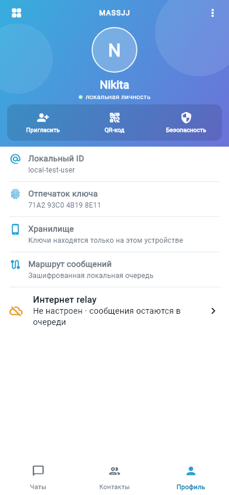

# MassJJ

Экспериментальный P2P-мессенджер без номера телефона и электронной почты.
Текущая альфа ориентирована на Android и предназначена для разработки,
исследований и закрытого тестирования.

> [!WARNING]
> MassJJ пока не является production-secure или анонимным мессенджером.
> Криптографический протокол MVP не проходил независимый аудит и не имеет
> Double Ratchet, forward secrecy или post-compromise security. Не используйте
> эту версию для чувствительной переписки.

## Как выглядит

<p align="center">
  
  
  
</p>

## Что уже работает

- локальная личность без централизованной регистрации;
- восстановление личности с помощью recovery-кода;
- добавление контакта по текстовому приглашению или QR-коду;
- шифрование сообщений до передачи транспорту;
- защищённое локальное хранилище;
- локальная очередь сообщений при отсутствии маршрута;
- прямой обмен в одной Wi-Fi/LAN-сети через приватное mDNS-обнаружение;
- опциональный непрозрачный relay, который хранит только зашифрованные пакеты;
- настройка HTTPS-relay из профиля без пересборки приложения;
- светлый Android-интерфейс MassJJ.

Телефон, email и облачный аккаунт не требуются. При наличии соседнего устройства
клиент сначала пробует локальный маршрут, затем настроенный relay, после чего
сохраняет пакет в локальной очереди.

## Статус распространения

Официальных APK и GitHub Releases пока нет. Репозиторий является единственным
официальным источником кода, а тестовые сборки необходимо собирать самостоятельно.
Не устанавливайте APK из неизвестных источников, которые выдают себя за MassJJ.

Клиент уже умеет проверять последний опубликованный GitHub Release. Когда будет
настроен постоянный release-ключ и появится официальный APK с именем
`MassJJ-android.apk`, приложение покажет плашку, проверит SHA-256 загруженного
файла и откроет системный установщик Android. Подробности — в
[инструкции по релизам](docs/RELEASING.md).

Первая публичная цель — Android. Проекты iOS и Windows находятся в дереве для
дальнейшей разработки, но не входят в текущую поддерживаемую альфу.

## Быстрый старт

Требования:

- Flutter 3.47 или новее;
- Android SDK 36;
- Node.js 22+ только для локального relay.

```powershell
flutter pub get
flutter analyze
flutter test
flutter build apk --release
```

Готовый локальный APK появится в
`build/app/outputs/flutter-apk/app-release.apk`. Текущая release-конфигурация
использует debug-подпись при отсутствии локального `android/key.properties` и
подходит только для разработки и закрытого теста.

### Локальный relay

Relay использует только встроенные модули Node.js:

```powershell
node server/relay.mjs
node --test server/test/*.test.mjs
```

По умолчанию он слушает только `127.0.0.1:8787`. Не публикуйте этот MVP-relay
в интернете: ему ещё нужны безопасное создание mailbox, глобальные квоты,
rate limiting, TLS, ротация capabilities и production-хранилище.

Для локальной разработки:

```powershell
flutter run --dart-define=RELAY_URL=http://127.0.0.1:8787 `
  --dart-define=ALLOW_INSECURE_RELAY=true
```

Android-эмулятор обычно обращается к хосту через `10.0.2.2`. Для любого
пользовательского и release-подключения клиент требует HTTPS. Опция
`ALLOW_INSECURE_RELAY` предназначена только для явной локальной разработки.
Без развёрнутого совместимого relay сообщения по мобильному интернету остаются
в зашифрованной локальной очереди; встроенного публичного сервера пока нет.

## Архитектура

```text
UI -> AppController -> CryptoEngine -> EncryptedPacket -> TransportRouter
                                                        |-> Nearby LAN
                                                        |-> Internet relay
                                                        `-> Local outbox
```

Подробнее:

- [архитектура](docs/ARCHITECTURE.md);
- [локальный Wi-Fi/LAN-транспорт](docs/NEARBY_WIFI.md);
- [модель безопасности MVP](docs/SECURITY_MODEL.md);
- [план миграции на Double Ratchet](docs/RATCHET_MIGRATION.md);
- [контекст для AI-разработчиков](docs/AI_HANDOFF.md).

## План развития

- исправить блокирующие security-риски relay и транспорта;
- перейти на аудированный протокол с forward secrecy;
- добавить подписываемые Android alpha-сборки;
- протестировать обмен на двух физических Android-устройствах;
- добавить отправку файлов и уведомления;
- реализовать Bluetooth/Wi-Fi Direct и DTN-передачу через промежуточные устройства;
- вернуться к Windows и iOS после стабилизации Android.

## Участие в разработке

Перед изменениями прочитайте [CONTRIBUTING.md](CONTRIBUTING.md),
[SECURITY.md](SECURITY.md) и [AGENTS.md](AGENTS.md). Уязвимости не следует
публиковать в обычных Issues — используйте приватный Security Advisory.

## Поддержать автора

- **BTC:** `bc1qky9hfme9jq27ede0yjhd4f4xstkx8y2lapq76l`
- **GRAM:** `UQBFqd3o_0Ws-ylj0s2Bru38Stbf2C6P5GE28mHkMyIyrzkE`
- **UCDT (SOL):** `FogudfiZNEX6G9UXqCJ3g5Cn6oTWE5nkisF1P4Xjn8XQ`

Перед отправкой обязательно проверьте выбранную сеть и адрес. Адреса также
продублированы в [SUPPORT.md](SUPPORT.md).

## Лицензия

MassJJ распространяется по лицензии
[GNU Affero General Public License v3.0](LICENSE). Изменённые версии клиента или
relay, предоставляемые пользователям по сети, должны сохранять открытый исходный
код на условиях AGPL-3.0.
